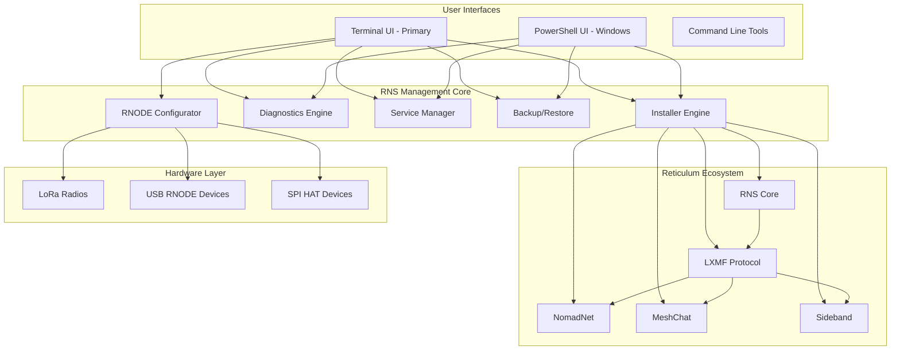
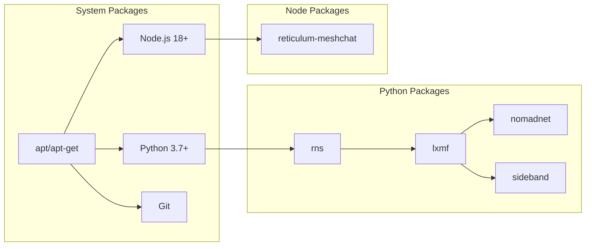

# RNS Management Tool - Development Guide

**Complete Reticulum Network Stack Management Solution** - A comprehensive, cross-platform management tool for the Reticulum ecosystem, featuring automated installation, configuration, and maintenance capabilities.

## Project Overview

RNS Management Tool transforms any Raspberry Pi or Linux/Windows machine into a complete Reticulum network management station. The tool bridges the gap between complex network stack configuration and user-friendly operation.

**Key Tagline:** "Complete Reticulum Ecosystem Management - One Tool, All Platforms"

**Version:** 2.2.0 | **License:** MIT | **Languages:** Bash 65%, PowerShell 30%, Markdown 5%

---

## Development Philosophy

The project follows a pragmatic tiered priority system:

1. **Make it work** - Establish functional capability first
2. **Make it reliable** - Strengthen error handling and security
3. **Make it maintainable** - Code clarity and documentation
4. **Make it fast** - Optimize only when justified by evidence

---

## Architecture Overview



---

## Directory Structure

```
/home/user/RNS-Management-Tool/
├── rns_management_tool.sh          # PRIMARY: Linux/Raspberry Pi TUI (2,588 lines)
├── rns_management_tool.ps1         # Windows PowerShell version (1,199 lines)
├── reticulum_updater.sh            # Specialized update script (949 lines)
├── FIXES_TO_APPLY.sh               # Node.js modernization fixes
├── QUICK_FIXES.sh                  # npm/pip upgrade utilities
│
├── README.md                        # Primary project documentation
├── CLAUDE.md                        # THIS FILE - Development guide
├── QUICKSTART.md                   # 5-minute setup guide
├── CHANGELOG.md                    # Version history (semantic versioning)
│
├── CODE_REVIEW_REPORT.md           # Code quality analysis
├── DEPRECATION_AUDIT_REPORT.md     # Dependency audit findings
├── VERIFICATION_REPORT.md          # Security verification
├── EXECUTIVE_SUMMARY.md            # High-level overview
└── VISUAL_GUIDE.md                 # UI feature showcase
```

---

## Core Capabilities

### Feature Matrix

| Category | Feature | Bash | PowerShell | Status |
|----------|---------|------|------------|--------|
| Installation | Full ecosystem install | ✅ | ✅ | Working |
| Installation | Selective component updates | ✅ | ✅ | Working |
| Installation | MeshChat with Node.js | ✅ | ✅ | Working |
| RNODE | Auto-install firmware | ✅ | ⚠️ Basic | Working |
| RNODE | Radio parameter config | ✅ | ❌ | Bash only |
| RNODE | EEPROM management | ✅ | ❌ | Bash only |
| Services | Start/Stop/Restart rnsd | ✅ | ✅ | Working |
| Services | meshtasticd integration | ✅ | ❌ | Bash only |
| Backup | Automatic timestamped | ✅ | ✅ | Working |
| Backup | Export/Import archives | ✅ | ✅ | Working |
| Backup | Factory reset | ✅ | ✅ | Working |
| Diagnostics | Environment detection | ✅ | ✅ | Working |
| Diagnostics | USB device detection | ✅ | ⚠️ | Working |
| UI | Quick Status Dashboard | ✅ | ✅ | Working |
| UI | Progress indicators | ✅ | ✅ | Working |

---

## Security Rules (Adapted from MeshForge)

The project enforces strict security practices:

| Rule | Requirement | Enforcement |
|------|-------------|-------------|
| RNS001 | Array-based command execution, never `eval` | Code review |
| RNS002 | Input validation for all device ports | Regex validation |
| RNS003 | Numeric range validation for radio parameters | Bounds checking |
| RNS004 | Path traversal prevention in import/export | Path validation |
| RNS005 | No shell=True in subprocess (Python tools) | Linter |

### Security Examples

```bash
# CORRECT: Array-based command execution
declare -a CMD_ARGS=("$DEVICE_PORT")
CMD_ARGS+=("--freq" "$FREQ")
rnodeconf "${CMD_ARGS[@]}"

# WRONG: String interpolation (command injection risk)
eval "rnodeconf $DEVICE_PORT --freq $FREQ"  # NEVER DO THIS

# CORRECT: Device port validation
if [[ ! "$DEVICE_PORT" =~ ^/dev/tty[A-Za-z0-9]+$ ]]; then
    print_error "Invalid device port format"
    return 1
fi

# CORRECT: Numeric validation with range
if [[ "$SF" =~ ^[0-9]+$ ]] && [ "$SF" -ge 7 ] && [ "$SF" -le 12 ]; then
    CMD_ARGS+=("--sf" "$SF")
fi
```

---

## UI Design Principles

### Raspi-Config Style Terminal UI

The tool follows the raspi-config design philosophy:

1. **TUI as Dispatcher** - Terminal UI selects what to run, not how
2. **Clear Visual Hierarchy** - Box drawing, colors, and sections
3. **Status at a Glance** - Quick dashboard on main menu
4. **Breadcrumb Navigation** - Always know where you are
5. **Graceful Degradation** - Missing features disable, don't crash

### Color Scheme

```bash
# Status Indicators
GREEN   = Success/Running   [✓] or ●
YELLOW  = Warning/Stopped   [!] or ○
RED     = Error/Failed      [✗]
CYAN    = Information       [i]
BLUE    = Section headers   ▶
MAGENTA = Emphasis          (sparingly)

# Box Drawing Characters
╔════════════════════════╗  # Header top
║  Content               ║  # Content line
╟────────────────────────╢  # Divider
╚════════════════════════╝  # Header bottom

┌────────────────────────┐  # Standard box top
│  Content               │  # Standard content
├────────────────────────┤  # Standard divider
└────────────────────────┘  # Standard box bottom
```

### Menu Structure

```
Main Menu
├── Installation ───────────────────
│   ├── 1) Install/Update Reticulum Ecosystem
│   ├── 2) Install/Configure RNODE Device
│   ├── 3) Install NomadNet
│   ├── 4) Install MeshChat
│   └── 5) Install Sideband
│
├── Management ─────────────────────
│   ├── 6) System Status & Diagnostics
│   ├── 7) Manage Services
│   ├── 8) Backup/Restore Configuration
│   └── 9) Advanced Options
│
└── Help & Exit ────────────────────
    ├── h) Help & Quick Reference
    └── 0) Exit
```

---

## Development Standards

### Code Organization

1. **Functions should be < 200 lines** - Break long functions into helpers
2. **Single responsibility** - Each function does one thing well
3. **Consistent naming** - `print_*`, `show_*`, `check_*`, `install_*`
4. **Error handling first** - Validate inputs before processing

### Testing Requirements

```bash
# Syntax validation (run before committing)
bash -n rns_management_tool.sh

# ShellCheck for style and security
shellcheck rns_management_tool.sh

# PowerShell syntax check
pwsh -NoProfile -Command "& { Get-Content rns_management_tool.ps1 | Out-Null }"
```

### Commit Message Format

```
<type>(<scope>): <description>

Types: feat, fix, docs, style, refactor, test, chore
Scope: bash, powershell, docs, rnode, service, backup

Examples:
feat(bash): add factory reset with safety backup
fix(rnode): validate device port format before execution
docs: update CLAUDE.md with security rules
```

---

## Known Issues & Workarounds

### Critical Issues

1. **Node.js 18 EOL** (April 2025)
   - Impact: MeshChat requires Node.js 18+
   - Solution: Script auto-upgrades to Node.js 22 LTS via NodeSource

2. **pip --break-system-packages**
   - Impact: Required on Debian 12+ for pip install
   - Solution: Already implemented in install commands

### Platform-Specific

| Issue | Platform | Workaround |
|-------|----------|------------|
| RNODE not detected | Linux | `sudo usermod -aG dialout $USER` |
| rnsd won't start | All | Check `~/.reticulum/config` exists |
| MeshChat build fails | All | Upgrade Node.js to 18+ |
| Permission denied | Linux | `chmod +x rns_management_tool.sh` |

---

## Tool Audit for Reticulum Ecosystem

### Core Tools Integration

| Tool | Purpose | Integration Level |
|------|---------|-------------------|
| `rnsd` | Reticulum daemon | Full (start/stop/status) |
| `rnstatus` | Network status | Full (diagnostics) |
| `rnodeconf` | RNODE configuration | Full (21+ device support) |
| `pip3` | Python packages | Full (RNS, LXMF, NomadNet) |
| `npm` | Node.js packages | Full (MeshChat) |
| `git` | Source cloning | Full (MeshChat, Sideband) |
| `systemctl` | Service management | Partial (user services) |

### External Dependencies



---

## Code Review Checklist (MeshForge Principles)

### Security Checklist
- [ ] No `eval` or `shell=True` usage
- [ ] Input validation for all user inputs
- [ ] Device port regex validation
- [ ] Numeric bounds checking
- [ ] Path traversal prevention
- [ ] No hardcoded credentials

### Quality Checklist
- [ ] Functions under 200 lines
- [ ] Single responsibility per function
- [ ] Consistent error handling
- [ ] Logging for all operations
- [ ] User feedback (progress, status)
- [ ] Graceful degradation for missing deps

### UI/UX Checklist
- [ ] Clear menu hierarchy
- [ ] Consistent color usage
- [ ] Status indicators visible
- [ ] Help available (h or ?)
- [ ] Breadcrumb navigation
- [ ] Confirmation for destructive actions

---

## Contributing

### Development Setup

```bash
# Clone the repository
git clone https://github.com/Nursedude/RNS-Management-Tool.git
cd RNS-Management-Tool

# Run syntax checks
bash -n rns_management_tool.sh
shellcheck rns_management_tool.sh

# Test locally (dry run)
./rns_management_tool.sh
```

### Pull Request Process

1. Fork the repository
2. Create feature branch: `git checkout -b feat/my-feature`
3. Run syntax and security checks
4. Update documentation if needed
5. Submit PR with clear description

---

## Resources

| Resource | URL | Purpose |
|----------|-----|---------|
| Reticulum Manual | reticulum.network/manual | Primary documentation |
| RNS GitHub | github.com/markqvist/Reticulum | Source code |
| RNODE Firmware | github.com/markqvist/RNode_Firmware | Device firmware |
| MeshChat | github.com/liamcottle/reticulum-meshchat | Web interface |
| Sideband | unsigned.io/sideband | Mobile client |
| MeshForge | github.com/Nursedude/meshforge | NOC reference |

---

## Project Metrics

- **Total Lines of Code:** ~4,000 lines (all shell scripts)
- **Documentation:** 16 markdown files (~150 KB)
- **Functions:** 65+ total functions
- **Security Rating:** A (91/100)
- **Code Quality:** A- (90/100)

---

**Maintainer:** Nursedude
**Repository:** github.com/Nursedude/RNS-Management-Tool

*Made with care for the Reticulum community*
