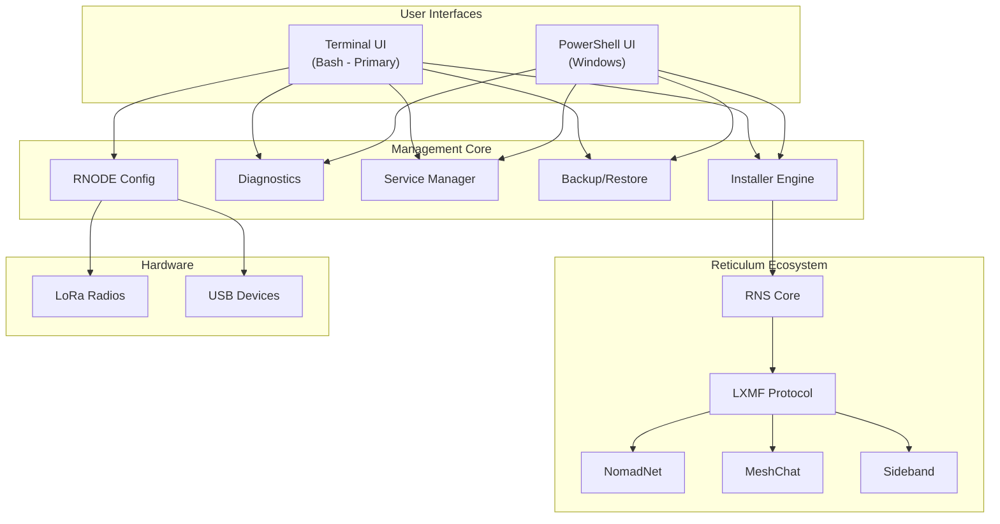
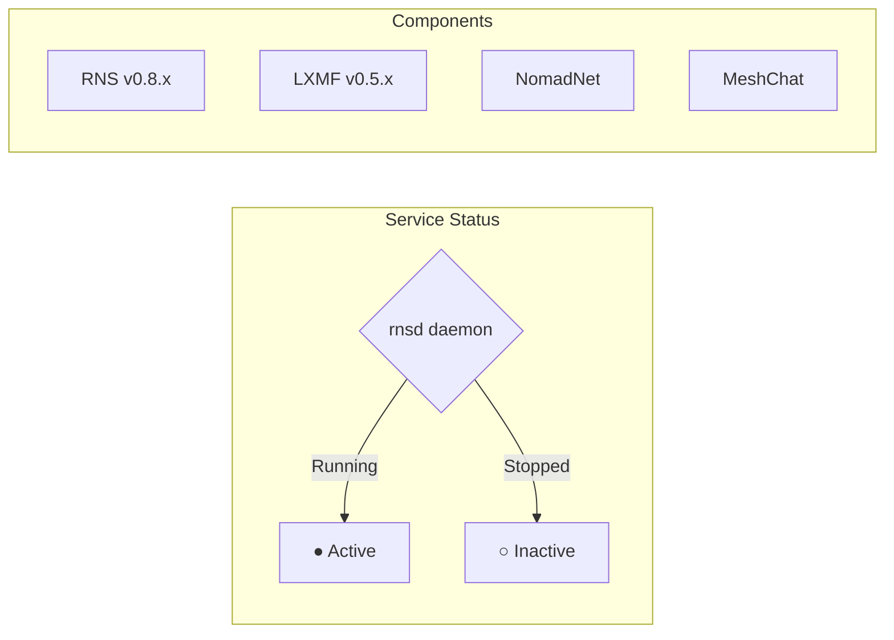
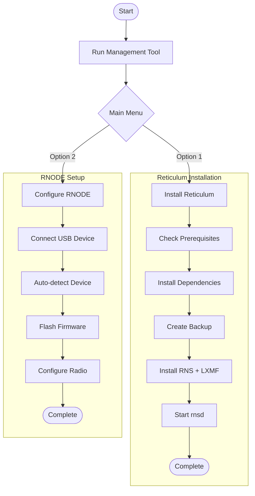
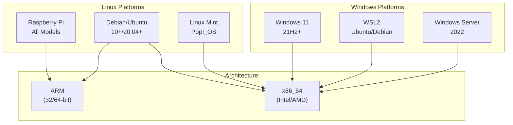
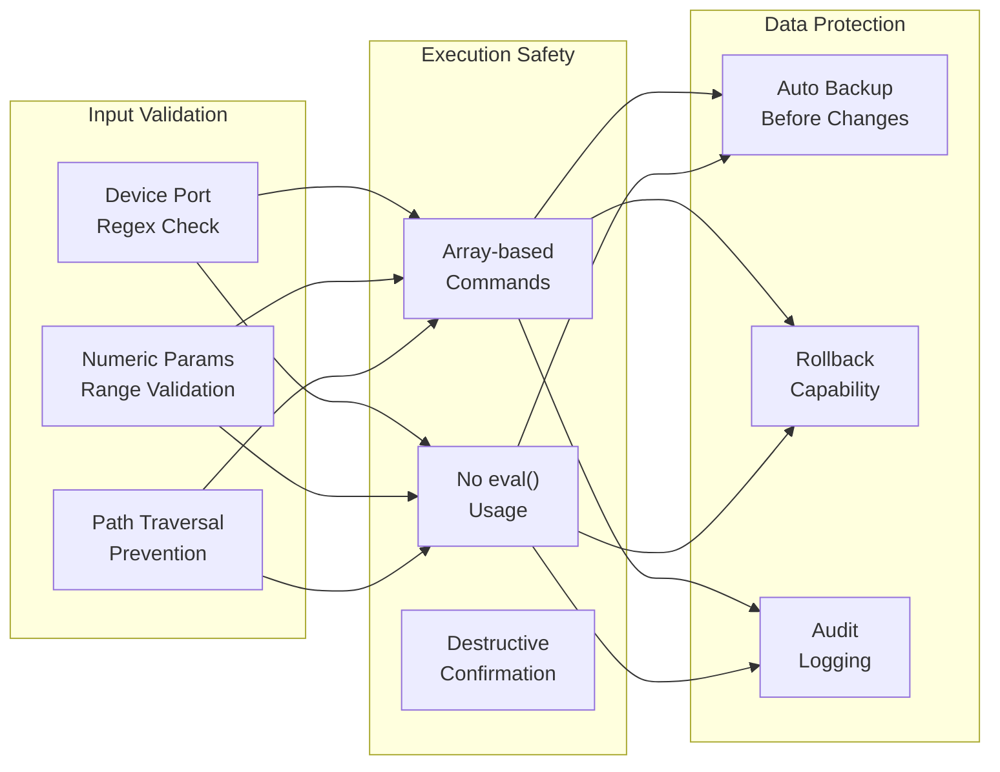

# RNS Management Tool

**Complete Reticulum Network Stack Management Solution**

A comprehensive, cross-platform management tool for the Reticulum ecosystem, featuring automated installation, configuration, and maintenance capabilities for Raspberry Pi, Linux, Windows 11, and WSL environments.


---

## Architecture Overview



---

## Quick Status Dashboard



---

## 🌟 Features

### Core Functionality
- ✅ **Cross-Platform Support** - Works on Raspberry Pi, Linux, Windows 11, and WSL2
- ✅ **Interactive Menu System** - Easy-to-use interface with visual feedback
- ✅ **Automatic Version Detection** - Intelligently detects installed components
- ✅ **Smart Dependency Management** - Installs packages in the correct order
- ✅ **Comprehensive Backup System** - Automatic configuration backups with restore
- ✅ **Service Management** - Start, stop, and monitor Reticulum services
- ✅ **Detailed Logging** - Complete installation and operation logs
- ✅ **Error Recovery** - Smart error handling with recovery suggestions

### Reticulum Ecosystem
- **RNS (Reticulum Network Stack)** - Core cryptographic networking
- **LXMF** - Lightweight Extensible Message Format protocol
- **NomadNet** - Terminal-based messaging and file sharing
- **MeshChat** - Modern web-based messaging interface
- **Sideband** - Mobile-first LXMF client
- **RNODE** - Complete RNODE device setup and configuration

### RNODE Support (NEW!)
- 🔧 **Interactive RNODE Installer** - Automated firmware flashing
- 🔧 **Device Configuration Wizard** - Step-by-step setup for all supported devices
- 🔧 **Auto-Install Mode** - Automatic device detection and flashing
- 🔧 **Firmware Updates** - Keep your RNODE devices up to date
- 🔧 **Device Testing** - Verify RNODE functionality
- 🔧 **Support for 21+ Boards** - LilyGO T-Beam, Heltec LoRa32, RAK4631, and more

## 📋 Requirements

### Raspberry Pi / Linux
- Raspberry Pi OS (any version) or Debian/Ubuntu-based system
- Python 3.7 or higher
- 512MB+ RAM recommended
- Internet connection (for installation)

### Windows 11
- Windows 11 (version 21H2 or higher)
- PowerShell 5.1+ or PowerShell Core 7+
- Python 3.7+ (will offer to install if missing)
- Administrator rights (recommended)

### Optional
- Node.js 18+ (for MeshChat)
- Git (for source installations)
- USB port (for RNODE devices)

## 🚀 Quick Start

### Linux / Raspberry Pi

```bash
# Download the installer
wget https://raw.githubusercontent.com/Nursedude/RNS-Management-Tool/main/rns_management_tool.sh

# Make it executable
chmod +x rns_management_tool.sh

# Run the tool
./rns_management_tool.sh
```

### Windows 11

```powershell
# Download the installer (PowerShell)
Invoke-WebRequest -Uri "https://raw.githubusercontent.com/Nursedude/RNS-Management-Tool/main/rns_management_tool.ps1" -OutFile "rns_management_tool.ps1"

# Run the tool (you may need to allow script execution)
Set-ExecutionPolicy -Scope Process -ExecutionPolicy Bypass
.\rns_management_tool.ps1
```

### Windows Subsystem for Linux (WSL)

The Windows version includes WSL support! You can:
1. Install directly in Windows (native)
2. Install through WSL (recommended for RNODE devices)
3. Manage both simultaneously

## 📖 Usage Guide

### Main Menu Options

1. **Install/Update Reticulum Ecosystem** - Complete stack installation
2. **Install/Configure RNODE Device** - Interactive RNODE setup
3. **Install NomadNet** - Terminal messaging client
4. **Install MeshChat** - Web-based messaging interface
5. **Install Sideband** - Mobile-focused client
6. **System Status & Diagnostics** - Check installation health
7. **Manage Services** - Start/stop/restart services
8. **Backup/Restore Configuration** - Protect your setup
9. **Advanced Options** - System updates, logs, and more

### RNODE Configuration Options

When you select "Install/Configure RNODE Device", you'll see:

1. **Auto-install firmware** (Easiest - Recommended)
   - Automatically detects and flashes your device
   - No manual configuration needed
   - Works with all supported boards

2. **List supported devices**
   - View all 21+ supported boards
   - Check compatibility before purchase

3. **Flash specific device**
   - Manual device selection
   - Custom port configuration

4. **Update existing RNODE**
   - Keep firmware up to date
   - Preserve configuration

5. **Test RNODE connection**
   - Verify device functionality
   - Check signal strength

6. **Advanced configuration**
   - EEPROM management
   - Bootloader updates
   - Custom parameters

### First-Time Setup



**For a complete Reticulum installation:**

1. Run the management tool
2. Select option **1** (Install/Update Reticulum Ecosystem)
3. The tool will:
   - Check prerequisites
   - Install Python dependencies if needed
   - Create a backup of existing configurations
   - Install RNS, LXMF, and optionally NomadNet
   - Start the rnsd daemon
   - Show installation status

**For RNODE setup:**

1. Connect your RNODE device via USB
2. Run the management tool
3. Select option **2** (Install/Configure RNODE Device)
4. Choose option **1** (Auto-install firmware)
5. The tool will automatically detect and configure your device

## 🔧 Advanced Features

### Automatic Backup System

The tool automatically creates timestamped backups before any major operation:

```
~/.reticulum_backup_20251229_143052/
├── .reticulum/
│   ├── config
│   ├── identity
│   └── storage/
├── .nomadnetwork/
│   └── config
└── .lxmf/
    └── config
```

### Service Management

Control Reticulum services with ease:

```bash
# The tool handles these operations through the menu
- Start rnsd daemon
- Stop all services safely
- Monitor service status
- Restart after updates
```

### Logging

All operations are logged to timestamped files:

```
~/rns_management_YYYYMMDD_HHMMSS.log
```

View logs through the Advanced Options menu.

### Environment Detection

The tool automatically detects:
- Raspberry Pi model (all variants: Pi 1, 2, 3, 4, 5, Zero, etc.)
- Operating system and version
- Architecture (ARM, x86_64, etc.)
- WSL environment
- Available Python versions
- Existing installations

## 📊 System Status & Diagnostics

The diagnostic tool provides:

- **Environment Information** - OS, architecture, platform details
- **Python Environment** - Version, path, packages
- **Network Interfaces** - Active connections
- **USB Devices** - Detect connected RNODEs
- **Reticulum Configuration** - Config file status
- **Service Status** - Running daemons and processes
- **Version Information** - All installed components

## 🎯 Supported Platforms



### Raspberry Pi
- ✅ Raspberry Pi 1 (all variants)
- ✅ Raspberry Pi 2 (all variants)
- ✅ Raspberry Pi 3 (all variants)
- ✅ Raspberry Pi 4 (all variants)
- ✅ Raspberry Pi 5
- ✅ Raspberry Pi Zero (all variants)
- ✅ Raspberry Pi 400
- ✅ Raspberry Pi Compute Modules

### Linux Distributions
- ✅ Raspberry Pi OS (32-bit and 64-bit)
- ✅ Ubuntu 20.04+
- ✅ Debian 10+
- ✅ Linux Mint
- ✅ Pop!_OS
- ✅ Any Debian-based distribution

### Windows
- ✅ Windows 11 (21H2+)
- ✅ Windows 11 with WSL2
- ✅ Windows Server 2022

### RNODE Devices (21+ Supported Boards)

**LilyGO**
- T-Beam (all variants)
- T-Deck
- LoRa32 v1.0, v2.0, v2.1
- T3S3
- T-Echo

**Heltec**
- LoRa32 v2, v3, v4
- Wireless Stick
- T114

**RAK Wireless**
- RAK4631

**SeeedStudio**
- XIAO ESP32S3

**Homebrew**
- Custom ATmega1284p builds
- Generic ESP32 boards
- Custom LoRa configurations

## 🛠️ Troubleshooting

### Common Issues

**Problem: "Python not found"**
```bash
# Linux/Raspberry Pi
sudo apt update
sudo apt install python3 python3-pip

# Windows
# The tool will offer to install Python automatically
```

**Problem: "rnsd won't start"**
```bash
# Check if config exists
ls -la ~/.reticulum/config

# Create initial config by running
rnsd --daemon
# (It will create default config on first run)
```

**Problem: "RNODE not detected"**
```bash
# Linux/Raspberry Pi - Check USB devices
ls -la /dev/ttyUSB* /dev/ttyACM*

# Check permissions
sudo usermod -a -G dialout $USER
# (Logout and login for changes to take effect)

# Windows - Check Device Manager for COM ports
```

**Problem: "MeshChat build fails"**
```bash
# Ensure Node.js 18+ is installed
node --version

# The tool will offer to upgrade Node.js automatically
```

**Problem: "Permission denied"**
```bash
# Ensure script is executable
chmod +x rns_management_tool.sh

# Some operations may need sudo (tool will prompt when needed)
```

### Getting Help

If you encounter issues:

1. **Check the logs**:
   ```bash
   # View the latest log file
   ls -lt ~/rns_management_*.log | head -1
   ```

2. **Run diagnostics**:
   - Select option **6** from the main menu
   - Review the output for any errors

3. **Backup and retry**:
   - Create a backup (option **8**)
   - Try the operation again

4. **Report issues**:
   - https://github.com/Nursedude/RNS-Management-Tool/issues
   - Include log files and system information

## 🔐 Security Model



### Security Rules (Adapted from MeshForge)

| Rule | Requirement | Status |
|------|-------------|--------|
| RNS001 | Array-based command execution, never `eval` | ✅ Enforced |
| RNS002 | Device port validation (regex) | ✅ Enforced |
| RNS003 | Numeric range validation | ✅ Enforced |
| RNS004 | Path traversal prevention | ✅ Enforced |
| RNS005 | Confirmation for destructive actions | ✅ Enforced |

### Security Features

- **Automatic backups** protect your configuration
- **Secure package installation** from official repositories only
- **No elevation unless necessary** - prompts before sudo operations
- **Configuration validation** before applying changes
- **Rollback capability** through backup/restore system

## 📚 Learn More

### Reticulum Network Stack
- Official Manual: https://reticulum.network/manual/
- GitHub: https://github.com/markqvist/Reticulum

### RNODE Hardware
- Hardware Guide: https://reticulum.network/manual/hardware.html
- Firmware: https://github.com/markqvist/RNode_Firmware
- Web Flasher: https://github.com/liamcottle/rnode-flasher

### Applications
- NomadNet: https://github.com/markqvist/nomadnet
- MeshChat: https://github.com/liamcottle/reticulum-meshchat
- Sideband: https://unsigned.io/sideband/

### Community
- Unsigned.io RNS Testnet: Connect and test your setup
- GitHub Discussions: Share experiences and get help

## 🤝 Contributing

Contributions are welcome! Please feel free to submit pull requests or open issues.

## 📝 License

This project is licensed under the MIT License - see the LICENSE file for details.

## 🙏 Acknowledgments

- **Mark Qvist** - Creator of Reticulum Network Stack
- **Liam Cottle** - MeshChat and RNode Web Flasher
- **Reticulum Community** - Testing and feedback

## 📅 Version History

### Version 2.2.0 (Current)
- ✨ **PowerShell Feature Parity** - Advanced Options menu now available on Windows
- ✨ **Enhanced Service Management** - Improved start/stop/restart options for rnsd
- ✨ **Configuration Export/Import (Windows)** - Portable .zip backup archives
- ✨ **Factory Reset (Windows)** - Complete configuration reset with safety backup
- ✨ **Update Checker** - Built-in version checking against GitHub releases
- 🔧 **Better Menu Organization** - Consistent navigation across both scripts
- 🔧 **Improved Error Messages** - More actionable error recovery hints
- 📚 **Code Review Documentation** - Comprehensive code quality analysis included
- 🎨 **UI Polish** - Better alignment and visual consistency
- 🐛 **Bug Fixes** - Various edge case improvements

### Version 2.1.0
- ✨ **Quick Status Dashboard** - See rnsd and RNS status at a glance on main menu
- ✨ **Organized Menu Sections** - Installation, Management, and System categories
- 🔒 **Security Fixes** - Replaced unsafe `eval` with array-based command execution
- 🔒 **Input Validation** - Device port and radio parameter validation
- 🔧 **Export/Import Configuration** - Portable backup archives (.tar.gz)
- 🔧 **Factory Reset** - Complete configuration reset with safety backup
- 🔧 **Windows Parity** - Added NomadNet install, diagnostics to PowerShell script
- 🐛 **Portability Fix** - Replaced `grep -oP` with portable `sed` alternatives

### Version 2.0.0
- ✨ Complete UI overhaul with interactive menus
- ✨ Windows 11 support with PowerShell installer
- ✨ WSL detection and integration
- ✨ Interactive RNODE installer and configuration wizard
- ✨ Enhanced Raspberry Pi detection (all models)
- ✨ Comprehensive diagnostics system
- ✨ Improved backup/restore functionality
- ✨ Better error handling and recovery
- ✨ Progress indicators and visual feedback
- ✨ Automated environment detection
- ✨ Service management improvements

### Version 1.0.0
- Initial release
- Basic update functionality
- Raspberry Pi support
- Simple command-line interface

## 🚀 What's Next?

Planned features:
- [ ] GUI version (Electron-based)
- [ ] Automatic update notifications
- [ ] Configuration templates for common setups
- [ ] Multi-node deployment tools
- [ ] Docker container support
- [ ] Integration with Sideband
- [ ] Performance monitoring dashboard
- [ ] Remote management capabilities

---

**Made with ❤️ for the Reticulum community**

For questions, suggestions, or support, please open an issue on GitHub.
